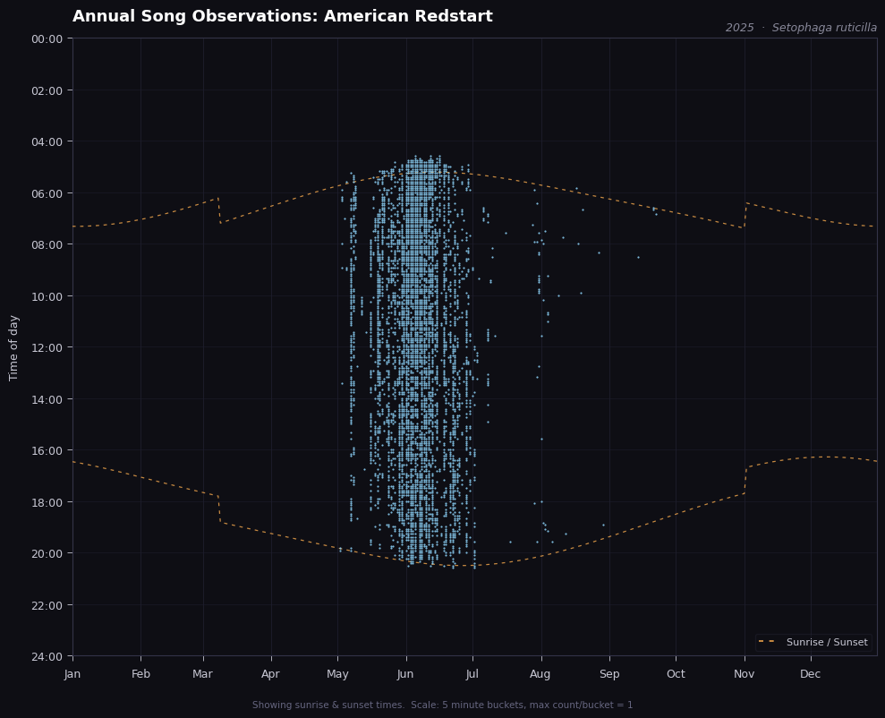
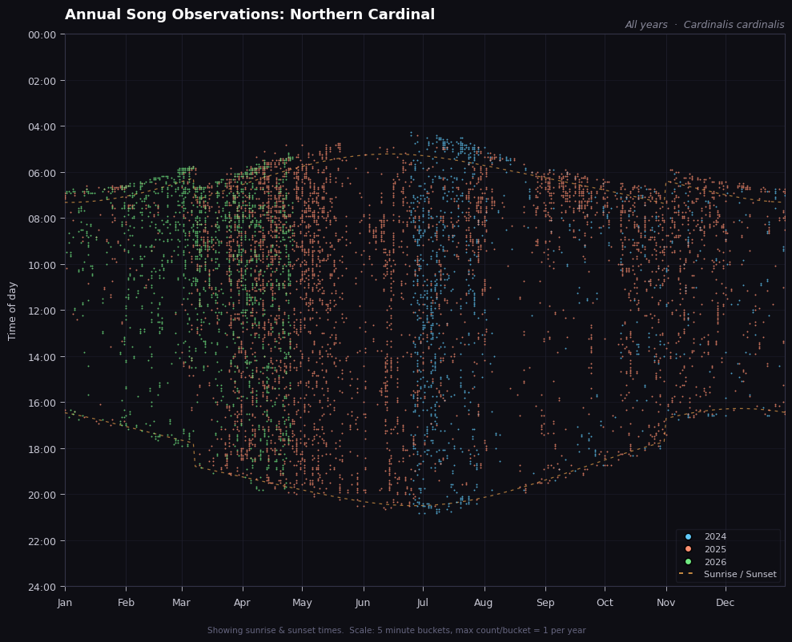
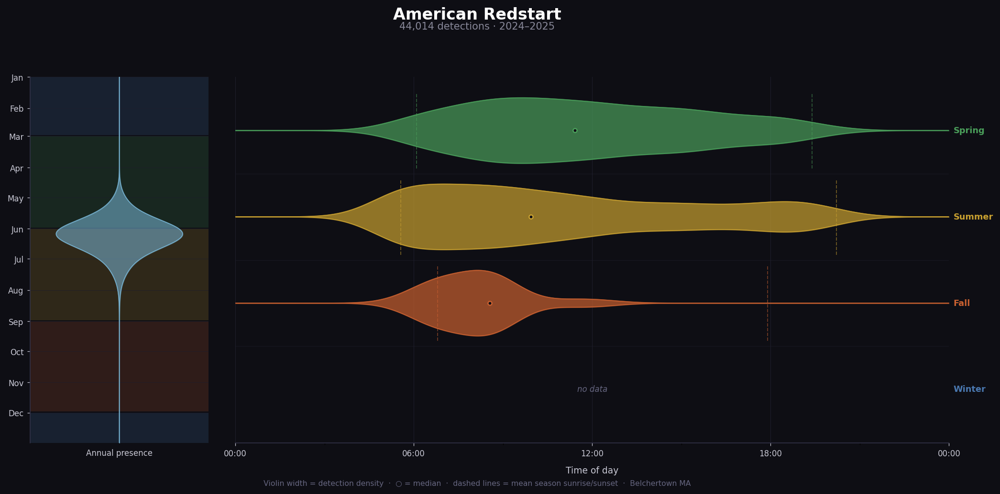
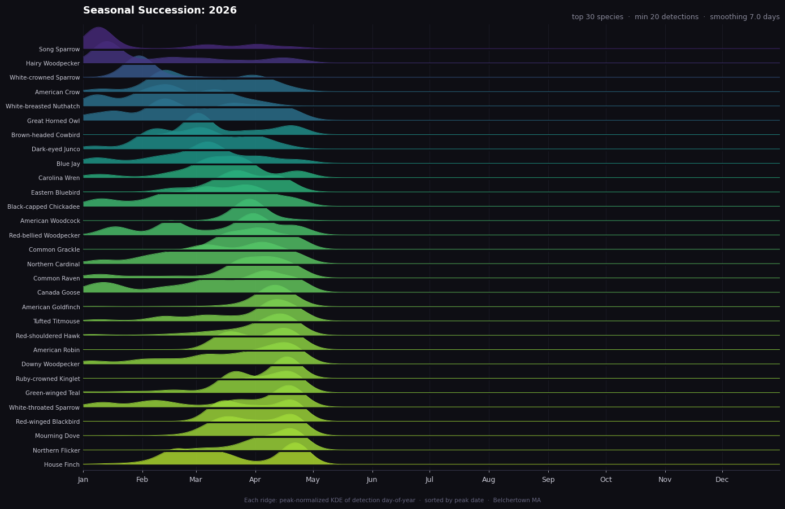
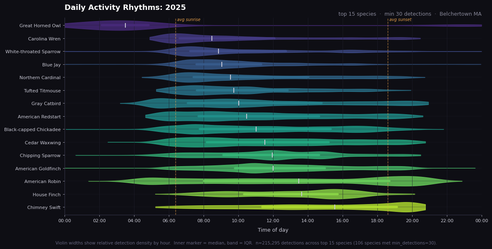
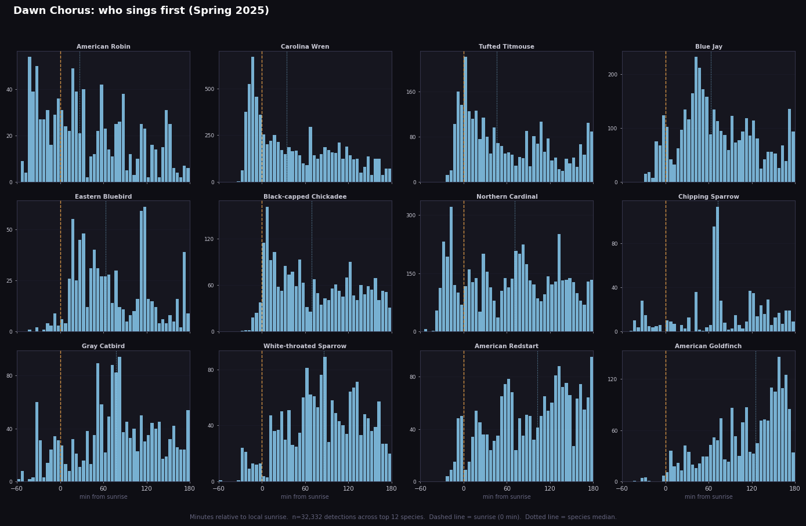
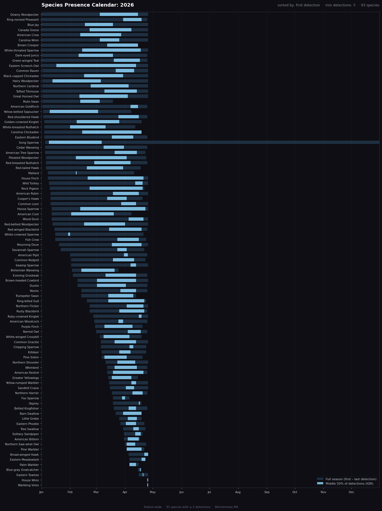
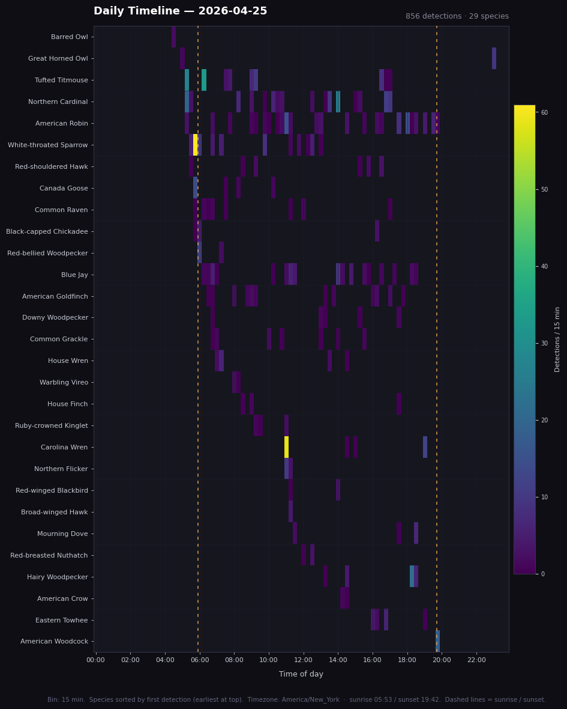
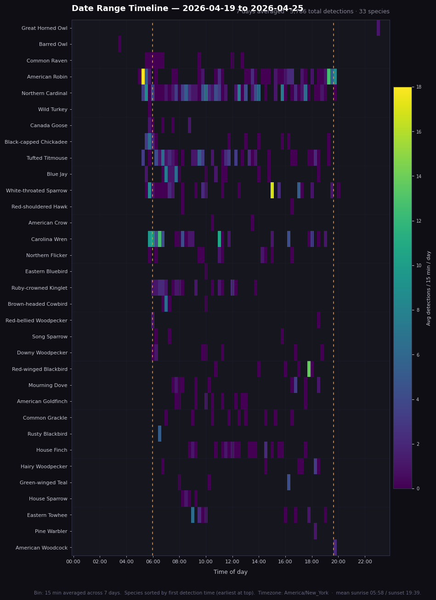

# BirdHeatmap

Local web dashboard for your [BirdWeather](https://birdweather.com) station.
Syncs detection history to a local SQLite database and renders species-activity
plots as server-side PNGs, plus interactive views for recent audio recordings,
species arrivals, and gone-quiet species.

---

## Plots

Species-level matplotlib plots, rendered server-side.  Select a plot type and
species in the UI; click **Show** to render.

| Plot | Species? | Description |
|------|----------|-------------|
| **Annual Song Observations** | per species | Year-long activity scatter: each dot is a 5-minute window with at least one detection. Sunrise/sunset curves overlaid. |
| **All Years (overlay)** | per species | Same axes as Annual Song Observations, every available year overlaid in distinct colours for direct comparison. |
| **Species Portrait** | per species | Vertical violin of annual presence (left) alongside seasonal time-of-day activity violins (right), all years pooled. |
| **Seasonal Succession (Ridge)** | per species | Ridge/joy plot of seasonal activity peaks — peak-normalized KDE of detection day-of-year, sorted so the cascade reads Jan→Dec. |
| **Time-of-Day Activity (Violin)** | per species | Horizontal violin of daily activity rhythm, sorted by median detection time. Supports year × season filtering and cross-year pooling (e.g. all springs combined). |
| **Dawn Chorus** | station-wide | Who sings first? Small-multiple histograms of detection time relative to local sunrise (−60 to +180 min), one panel per species, sorted earliest-to-latest singer. |
| **Species Presence Calendar** | station-wide | Horizontal bar chart: bars span first–last detection; bright overlay = middle 50% (IQR) of detection day-of-year. Shows when each species is most reliably present. |
| **Daily Timeline** | station-wide | All detections from a single day as a time-of-day × species heatmap. 15-minute bins, sunrise/sunset overlaid. Defaults to yesterday. |
| **Date Range Timeline** | station-wide | Same heatmap view across a date range, counts averaged per day so the colour scale stays comparable regardless of range length. Defaults to the last 7 days. |

---

## Interactive views

HTML pages with live or DB-backed data — no image rendering.
Accessible from the navigation bar at the top of every page.

| View | URL | Description |
|------|-----|-------------|
| **Recordings** | `/recordings` | The 100 most recent detections from BirdWeather, grouped by species with collapsible rows. Each detection has an HTML5 audio player pointing to the BirdWeather soundscape CDN. |
| **Species Recordings** | `/recordings/species/<id>` | The 100 most recent recordings for a single species. Reachable via the "all →" link on each species group, or the species dropdown at the top of the Recordings page (all 200+ DB species available). |
| **Arrivals** | `/arrivals` | Species detected for the first time within a chosen window (This Week / This Month / This Year / All Time). "First time" means no prior detection exists in the local DB before the window opened. Period selector swaps content via AJAX — no page reload. |
| **Missing** | `/missing` | Species that appeared in a past comparison window but have zero detections in the equivalent current window. Comparison selector: vs Last Week / vs Last Month / vs Same Period Last Year. AJAX period swap. |

---

## Quickstart (local development)

```bash
git clone <repo>
cd birdheatmap

# 1. Create a local .env with your config (copy the example and edit)
cp deploy/birdheatmap.env.example .env
# Edit .env — set STATION_ID to your BirdWeather station ID
# For local dev, also set:  DB_PATH=./dev_data/birdweather.sqlite
#                           CACHE_PATH=./dev_data/cache

# 2. Set up the venv and install the package
make install

# 3. Fetch two pages and print the raw API response (no DB writes)
make sync-dry

# 4. Run a test sync — roughly 30 days of data, takes ~40 seconds
BACKFILL_PAGE_SIZE=500 .venv/bin/python -m birdheatmap sync --max-pages 40

# 5. Start the web UI
make serve
# → open http://localhost:8765
```

---

## Syncing

### Data volume

A full backfill for an active station with ~400k detections takes roughly
**15–30 minutes** at 500 detections/page with a 1-second rate limit.
The backfill is resumable — interrupt it any time and restart; it picks up
from the last successfully fetched page.

### Manual one-shot sync

```bash
# Full backfill or incremental, whichever is needed:
make sync

# Same thing directly (useful on the server as the service user):
sudo -u birdheatmap /opt/birdheatmap/venv/bin/python -m birdheatmap sync
```

### Automatic incremental sync

When `serve` is running (or the systemd service is active), an in-process
scheduler runs a sync **immediately at startup**, then again every
`SYNC_INTERVAL_MINUTES` (default: 60). No cron jobs or timers needed.

---

## Deployment

### Prerequisites on the server

- Debian 11+ or Ubuntu 22.04+
- Python 3.11+ **and** `python3-venv` (`apt install python3-venv`)
- SSH access as a user with `sudo` rights

### First deploy — step by step

**1. On your workstation**, set the target host in the Makefile:

```bash
# In Makefile:
DEPLOY_HOST := <server-ip>
DEPLOY_USER := <your-ssh-user>
```

**2. Run the deploy target:**

```bash
make deploy
```

This tars the repo and pipes it to the server over SSH, then runs
`sudo deploy/install.sh`.  The script:

1. Checks Python 3.11+ and `python3-venv` are present.
2. Creates the `birdheatmap` system user (no login shell, no home dir).
3. Builds a Python venv at `/opt/birdheatmap/venv` and installs the package.
4. Pre-compiles all `.pyc` files so the service never needs to write to the
   code directory at runtime (required by the `ProtectSystem=strict` hardening).
5. Creates `/var/lib/birdheatmap/` (SQLite + PNG cache) owned by `birdheatmap`.
6. Creates `/etc/birdheatmap/birdheatmap.env` from the example **on first
   install only** — never overwrites an existing config file.
7. Installs and enables the systemd unit.
8. Starts (or restarts) the service.

**Config and database are never touched on upgrade.**

**3. On first install**, the script will print an ACTION REQUIRED notice.
SSH into the server and edit the env file with your station details:

```bash
sudo nano /etc/birdheatmap/birdheatmap.env
# Set STATION_ID to your BirdWeather station ID
# Set BACKFILL_FROM_DATE to a few days before your station came online
```

Then restart the service so it picks up the config:

```bash
sudo systemctl restart birdheatmap
```

**4. Watch the first backfill:**

```bash
journalctl -u birdheatmap -f
# You'll see "Backfill: page N  inserted=…" every 10 pages.
```

**5. Open the UI** from anywhere on your LAN:

```
http://<server-ip>:8765
```

### Subsequent upgrades

```bash
# From your workstation — updates code and restarts the service:
make deploy
```

### Paths on the server

| Path | Purpose |
|------|---------|
| `/opt/birdheatmap/` | Code + Python venv |
| `/var/lib/birdheatmap/birdweather.sqlite` | Local detection cache |
| `/var/lib/birdheatmap/cache/` | Rendered PNG cache |
| `/etc/birdheatmap/birdheatmap.env` | Runtime configuration |
| `/etc/systemd/system/birdheatmap.service` | Systemd unit |

### Useful commands on the server

```bash
# Follow live logs
journalctl -u birdheatmap -f

# Trigger a manual sync right now (runs as the service user)
sudo -u birdheatmap /opt/birdheatmap/venv/bin/python -m birdheatmap sync

# Check service status
systemctl status birdheatmap

# Stop / start / restart
sudo systemctl stop birdheatmap
sudo systemctl start birdheatmap
sudo systemctl restart birdheatmap
```

---

## Configuration

All settings live in `/etc/birdheatmap/birdheatmap.env` (production) or `.env`
(local dev).  See `deploy/birdheatmap.env.example` for the full list with comments.

| Variable | Default | Description |
|----------|---------|-------------|
| `STATION_ID` | *(required)* | Your BirdWeather station ID (numeric) |
| `BACKFILL_FROM_DATE` | `2020-01-01` | Earliest date to fetch during backfill — set to just before your station came online |
| `DB_PATH` | `/var/lib/birdheatmap/birdweather.sqlite` | SQLite database path |
| `CACHE_PATH` | `/var/lib/birdheatmap/cache` | PNG render cache directory |
| `BIND_HOST` | `0.0.0.0` | Address to listen on |
| `BIND_PORT` | `8765` | Web UI port |
| `SYNC_INTERVAL_MINUTES` | `60` | Incremental sync frequency |
| `BACKFILL_PAGE_SIZE` | `500` | Detections per GraphQL request |
| `BACKFILL_RATE_LIMIT_SECONDS` | `1.0` | Delay between backfill requests |
| `BIRDWEATHER_TOKEN` | same as `STATION_ID` | Token used in REST API URLs (`/api/v1/stations/{token}/…`). Public stations use their numeric ID; override if yours differs. |
| `BIRDWEATHER_REST_URL` | `https://app.birdweather.com/api/v1` | BirdWeather REST API base URL |

---

## CLI reference

```bash
python -m birdheatmap --help

python -m birdheatmap sync [--dry-run] [--max-pages N]
python -m birdheatmap serve
python -m birdheatmap render --plot annual_heatmap --species "American Redstart" --year 2025 --out out.png
python -m birdheatmap plots
python -m birdheatmap species
python -m birdheatmap reset-backfill   # clear backfill state to re-fetch all history
```

---

## Adding a new plot type

1. Create `src/birdheatmap/plots/my_new_plot.py`.
2. Expose the required interface:

```python
NAME: str = "my_new_plot"
DISPLAY_NAME: str = "My New Plot"
DESCRIPTION: str = "One sentence description shown in the UI."
PARAMS: list[dict] = [
    {"name": "year", "type": "int", "label": "Year", "default": None, "choices": None},
]

def render(db, species_id: int, **params) -> bytes:
    ...  # return PNG bytes
```

3. Restart the service — the registry auto-discovers it. No other files to edit.

Set `REQUIRES_SPECIES = False` at module level for station-wide plots that don't
need a species selection (the species dropdown is hidden automatically in the UI).

See `src/birdheatmap/plots/README.md` for the full parameter spec, and `_PALETTES`
in any existing plot file for how dark/light colour themes are structured.

## Adding a new interactive view

1. Create `src/birdheatmap/views/my_new_view.py`.
2. Expose the required interface:

```python
NAME: str = "my_new_view"
DISPLAY_NAME: str = "My New View"
DESCRIPTION: str = "One sentence description."

def render_data(db, **params) -> dict:
    ...  # return a plain dict; the Flask route passes it to a Jinja2 template
```

3. Create `src/birdheatmap/templates/my_new_view.html`.
4. Add a route in `src/birdheatmap/web.py` (follow the `arrivals_page` pattern).
5. Add a nav link to the header in each existing template.

The view registry auto-discovers all `.py` files in `src/birdheatmap/views/`.

---

## Troubleshooting

**Service won't start**
```bash
journalctl -u birdheatmap -n 50 --no-pager
# Common causes: missing env vars, /var/lib/birdheatmap not owned by birdheatmap.
```

**Backfill looks stalled**
```bash
journalctl -u birdheatmap -f
# Progress is logged every 10 pages.
# The backfill is resumable — stop and restart the service at any time.
```

**Backfill completed but old data is missing**
```bash
sudo -u birdheatmap /opt/birdheatmap/venv/bin/python -m birdheatmap reset-backfill
sudo systemctl restart birdheatmap
# The backfill will restart from scratch; existing data is kept (duplicates skipped).
```

**Plot not updating after new detections arrive**
The render cache is keyed on the newest detection timestamp, so it refreshes
automatically once new data is synced in. To force an immediate refresh:
```bash
sudo rm -f /var/lib/birdheatmap/cache/*.png
```

**Recordings page shows "API timed out"**
The BirdWeather REST API is temporarily unavailable. The Plots and DB-backed views
(Arrivals, Missing) continue to work from the local database. Retry in a moment.

**"Species not found in cache"**
The backfill hasn't reached that species yet, or sync hasn't run.
```bash
sudo -u birdheatmap /opt/birdheatmap/venv/bin/python -m birdheatmap sync
sudo -u birdheatmap /opt/birdheatmap/venv/bin/python -m birdheatmap species
```

**Permission denied writing to /var/lib/birdheatmap**
```bash
sudo chown -R birdheatmap:birdheatmap /var/lib/birdheatmap
```

---

## Sample plots

Annual Song Observations (American Redstart · 2025):


All Years (overlay) (Northern Cardinal · all years):


Species Portrait (American Redstart · all years):


Seasonal Succession / Ridge (Northern Cardinal · all years):


Time-of-Day Activity Violin (Northern Cardinal · 2025):


Dawn Chorus (station-wide · 2025):


Species Presence Calendar (station-wide · 2026):


Daily Timeline (station-wide · yesterday):


Date Range Timeline (station-wide · last 7 days):


---

## Acknowledgements

Inspired by [parsingphase/socialSensorSummaries](https://github.com/parsingphase/socialSensorSummaries).
